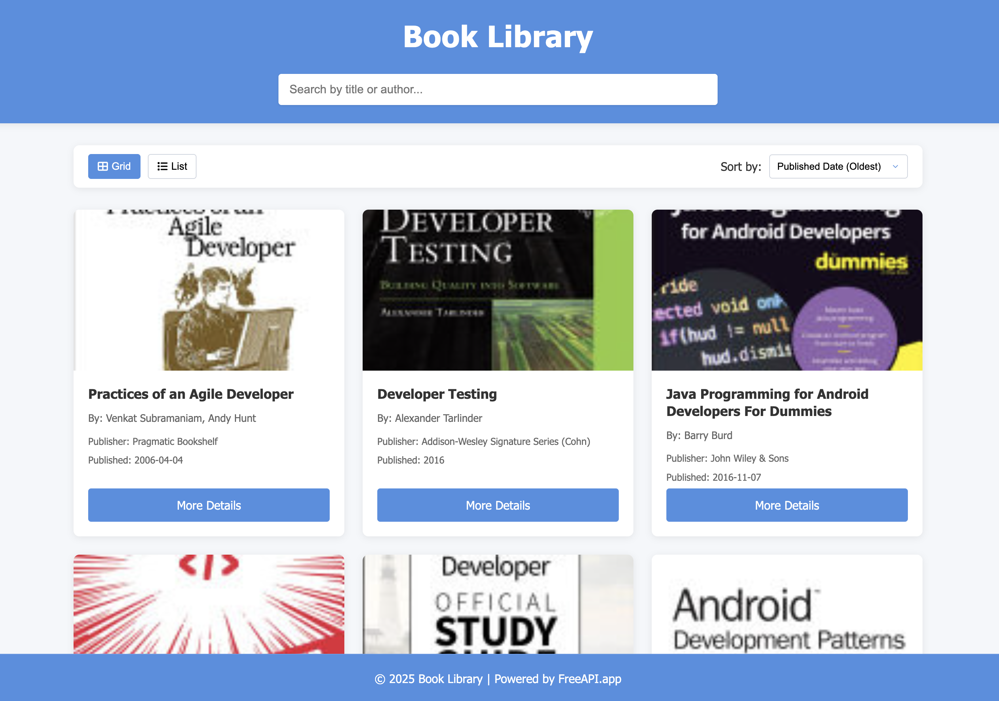
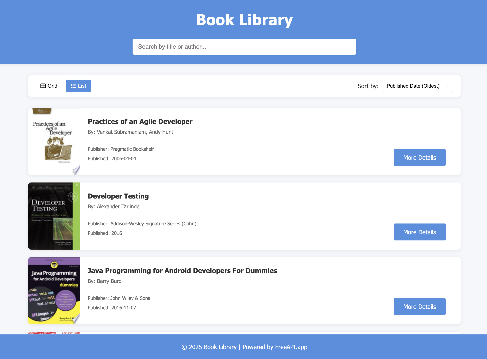
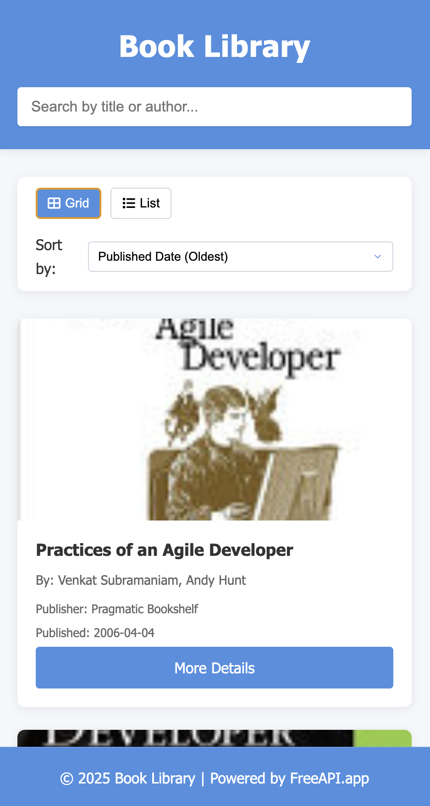

# Book Library

A modern, responsive web application that helps users browse and discover books with ease.



**Live Demo:** [Book Library Demo](https://learn.dipanshu.dev/book-library/)

## Features

- **Dynamic Book Browsing**: Fetches real book data from FreeAPI.app
- **Responsive Design**: Works seamlessly on desktop, tablet, and mobile devices
- **View Toggling**: Switch between grid and list views based on preference
- **Real-time Search**: Search activates automatically as you type (minimum 3 characters)
- **Clear Search**: One-click button to clear your search query
- **Sorting Options**: Sort books by title (A-Z or Z-A) or publication date (newest/oldest)
- **Pagination**: Navigate through multiple pages of results with intuitive controls
- **Book Details**: View book details including title, author, publisher, and publication date
- **External Links**: Open detailed book information in a new tab
- **Local Storage**: Remembers your view preferences, search terms, and current page

## Screenshots

### List View


### Mobile View


## Usage

### Searching for Books

Simply start typing in the search bar. The search will automatically trigger after you've typed at least 3 characters and will search for matches in both book titles and author names.

### Changing View Mode

- Click the "Grid" button to display books in a 3-column grid layout
- Click the "List" button to display books in a more detailed list format

### Sorting Books

Use the "Sort by" dropdown menu to arrange books by:
- Title (A-Z)
- Title (Z-A)
- Published Date (Newest)
- Published Date (Oldest)

### Pagination

- Navigate between pages using the "Previous" and "Next" buttons
- Jump to a specific page by clicking on the page number
- The current page is highlighted for easy reference

## Technical Details

- **HTML5** for structure
- **CSS3** with custom properties for styling
- **JavaScript (ES6+)** for interactive functionality
- **Responsive Design** using CSS Grid and Flexbox
- **Local Storage API** for saving user preferences

## API Integration

The application uses the FreeAPI.app Books API to fetch book data:
```
GET https://api.freeapi.app/api/v1/public/books
```

### API features utilized:
- Pagination parameters (page, limit)
- Search functionality (query parameter)
- Rich book metadata (titles, authors, publication info)


---

Created with ❤️ by Dipanshu